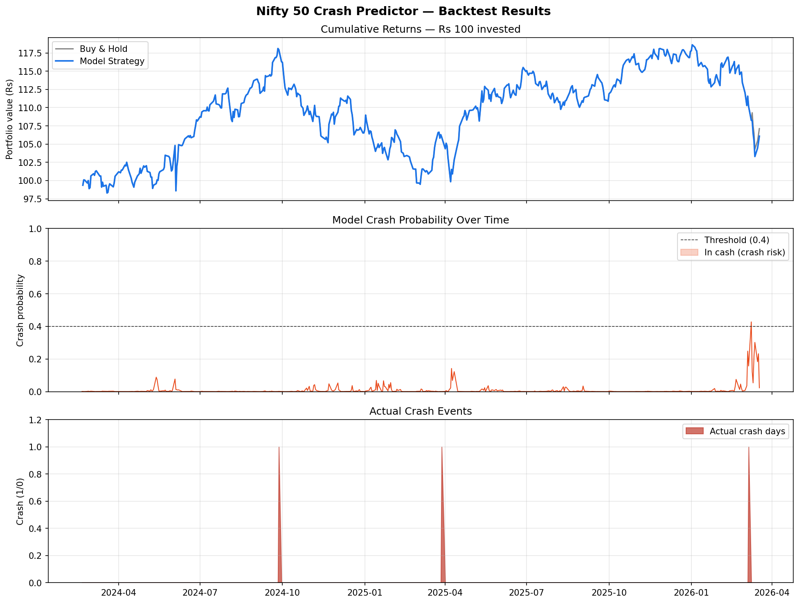

# Nifty 50 Market Crash Predictor

An end-to-end machine learning system that predicts the probability of a **>5% Nifty 50 crash within the next 5 trading days**, with a live Streamlit dashboard and a full strategy backtest.

---

## Demo



---

## What it does

| Component | Description |
|---|---|
| `model.py` | Downloads data, engineers 17 features, runs walk-forward CV, trains XGBoost |
| `backtest.py` | Simulates a cash-exit strategy vs buy-and-hold on out-of-sample data |
| `app.py` | Streamlit dashboard — live signal, backtest results, what-if VIX simulator |

---

## Model

- **Algorithm**: XGBoost Classifier
- **Data**: Nifty 50 (`^NSEI`) + India VIX (`^INDIAVIX`), Jan 2015 – Dec 2024
- **Target**: Binary — does Nifty drop >5% in the next 5 trading days?
- **Validation**: 5-fold walk-forward `TimeSeriesSplit` (no data leakage)
- **Class imbalance**: handled via `scale_pos_weight`

### Features (17 total)

| Group | Features |
|---|---|
| Returns | 1-day, 5-day, 10-day, 20-day price returns |
| Volatility | Rolling std of returns over 5 / 10 / 20 days |
| Drawdown | Distance from 5-day and 20-day rolling highs |
| Trend | Price vs 50-day MA, price vs 200-day MA, MA50/MA200 ratio |
| Volume | Today's volume vs 20-day average |
| VIX | Raw level, 5-day change, spike flag (>20) |
| Composite | Panic signal = VIX × 5-day volatility |

### Results (held-out test set — last 20% of data)

> Run `python model.py` to reproduce these numbers.

| Metric | Value |
|---|---|
| ROC-AUC | *(run model.py to generate)* |
| Walk-forward mean AUC | *(run model.py to generate)* |
| Crash class precision | *(run model.py to generate)* |
| Crash class recall | *(run model.py to generate)* |

---

## Backtest Strategy

- **Rule**: exit to cash when crash probability > 40%; otherwise stay invested in Nifty
- **Evaluated**: on the last 20% of data (out-of-sample only)

| Metric | Buy & Hold | Model Strategy |
|---|---|---|
| Total Return | *(run backtest.py)* | *(run backtest.py)* |
| Annualised Return | *(run backtest.py)* | *(run backtest.py)* |
| Sharpe Ratio | *(run backtest.py)* | *(run backtest.py)* |
| Max Drawdown | *(run backtest.py)* | *(run backtest.py)* |

---

## Quickstart

```bash
# 1. Clone
git clone https://github.com/YOUR_USERNAME/nifty-crash-predictor.git
cd nifty-crash-predictor

# 2. Create virtual environment
python -m venv venv
source venv/bin/activate        # Mac / Linux
venv\Scripts\activate           # Windows

# 3. Install dependencies
pip install -r requirements.txt

# 4. Train the model (prints CV results + saves model.pkl)
python model.py

# 5. Run the backtest (prints metrics + saves backtest_results.png)
python backtest.py

# 6. Launch the dashboard
streamlit run app.py
```

---

## Project Structure

```
nifty-crash-predictor/
├── model.py            # Data download, feature engineering, training
├── backtest.py         # Strategy backtest vs buy-and-hold
├── app.py              # Streamlit live dashboard
├── requirements.txt
└── README.md
```

---

## Disclaimer

This project is for educational purposes only. It is not financial advice and should not be used to make real investment decisions.
